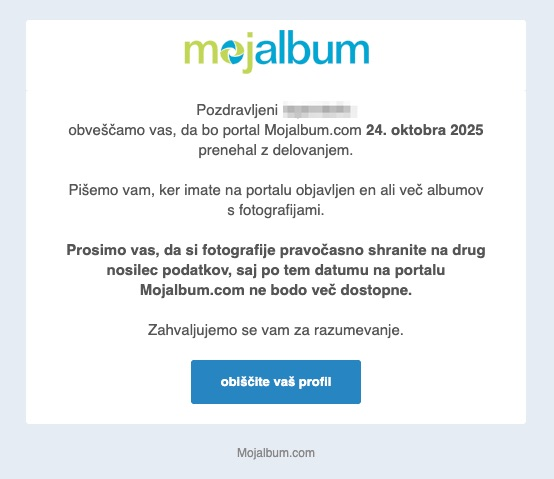
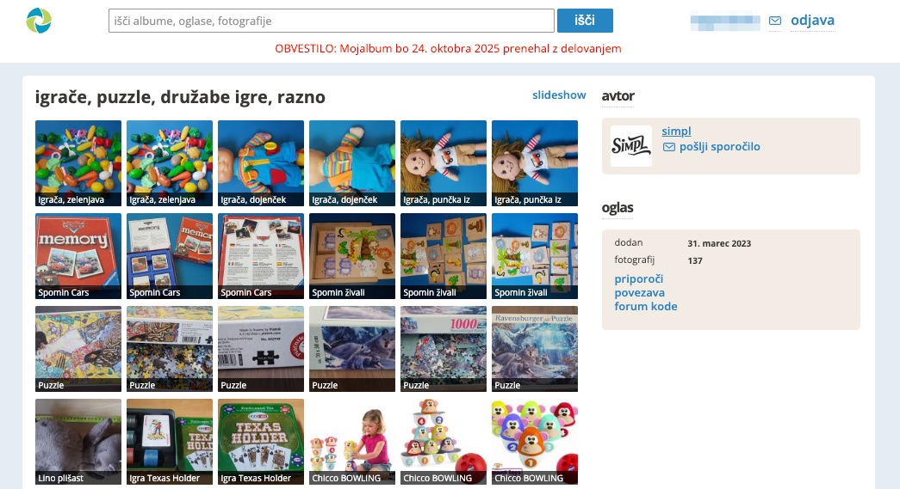

# MojAlbum Photo Downloader

**POMEMBNO: MojAlbum bo 24. oktobra 2025 prenehal z delovanjem!**

Ta skripta omogoča avtomatsko varnostno kopiranje vseh fotografij iz albumov na MojAlbum.com preden storitev preneha delovati. Če imaš kakšen album si verjetno dobil/a naslednji email:



[Primer albuma](https://mojalbum.com/simpl/igrace-puzzle-druzabe-igre-razno):



## Kaj skripta naredi

- Prenese **vse fotografije** iz kateregakoli MojAlbum albuma
- Obravnava albume z več stranmi
- Deluje s fotografijami **z opisi** in **brez opisov**
- Izključuje "podobne oglase" iz drugih albumov
- Avtomatsko ustvari mapo za vsak album

## Sistemske zahteve

- **Python 3.6 ali novejši** (preverite s `python3 --version`)

## Namestitev

### Možnost 1: Z virtualnim okoljem (priporočeno)

1. Ustvarite virtualno okolje:
```bash
python3 -m venv mojalbum_env
source mojalbum_env/bin/activate  # Linux/Mac
# ali
mojalbum_env\Scripts\activate     # Windows
```

2. Namestite potrebne knjižnice:
```bash
pip install requests beautifulsoup4
```

### Možnost 2: Brez virtualnega okolja

Direktno namestite potrebne knjižnice:
```bash
pip3 install --user requests beautifulsoup4
```

**Opomba**: Virtualno okolje je priporočeno, da se izognete konfliktom z drugimi Python paketi.

## Uporaba

Preprosto zaženite skripto:
```bash
python mojalbum_downloader.py
```

Skripta vas bo vprašala:
- URL vašega MojAlbum albuma (npr. `https://mojalbum.com/uporabnik/album`)
- kakšna naj bo zakasnitev med prenosi (priporočeno: 1 sekunda)

## Primer

```
Vnesite URL vašega albuma: https://mojalbum.com/janez/poletje2024
```

Skripta bo:
- Našla vse fotografije v albumu "poletje2024"
- Prenesla jih v mapo `janez_poletje2024_photos/`
- Fotografije shranila z ID-ji (npr. `5373703.jpg`)

## Značilnosti

- **Varno**: "spoštuje strežnik" z zakasnitvami med prenosi
- **Pametno**: preskoči že prenesene datoteke
- **Univerzalno**: deluje s katerimkoli MojAlbum albumom
- **Zanesljivo**: obravnava različne URL strukture

## Opozorilo

Uporabite skripto odgovorno in le za varnostno kopiranje lastnih albumov. Zloraba te skripte bo verjetno pripeljala do bana na MojAlbum.com strani.

### Transparentnost

_Skripta je bila ustvarjena s pomočjo Claude.ai_
